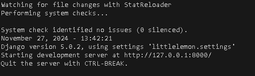
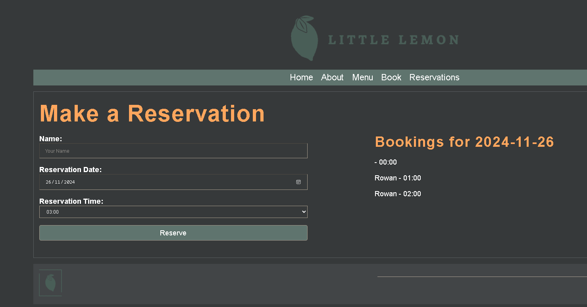
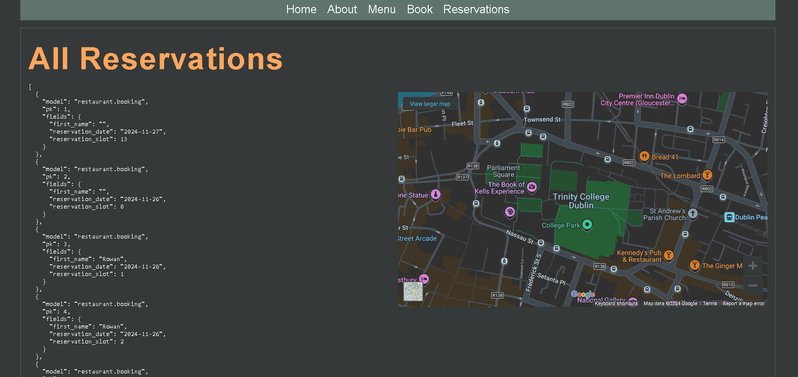

[INSTRUCTIONS ENGLISH]
For starters, this is my grade for META specialization course at FullStack module. This grade belongs to META Specialization "Back-End Developer Professional Certificate" by Coursera.

This is a project developed by me and given by META and Coursera to make it.

This project is a web called Little Lemon and it is supposed to be functional such as in showing the menus so as creating reservations and show them as Json.

So, [STEPS]

1) Using git terminal:
   -  git clone https://github.com/fransirvent1994/Coursera/META/FullStack/LittleLemon.git
   -  With this you will clone this repository into your local machine, so I suggest to have a specific directory to place it (f.e. an empty directory called "testing")

2) Once the repository is inside your local machine, go to your IDE (or whatever you use to develop and test codes) and open a new terminal (can be even the CMD or Linux Terminal).

3) Now, if don´t have a virtual environment and want to save space installing things, write on the terminal:
   - python -m venv my_environment (to create a virtual environment on Windows) or python3 -m venv mi_entorno ---> (macOS/Linux)
   - my_environment\Scripts\activate
   - source my_environment/bin/activate

4) Install Django once the environment is activated:
   - pip install Django
  
5) Run migrations if needed:
   - python manage.py makemigrations
   - python manage.py migrate

6) Now run it writing:
   - python manage.py runserver

Now it´s supposed to the terminal outputs something like this:

Now you will get access by RightMouseButton+Ctrl on the IP address and will get to the web, where you should see the options on the main page, and, on "Book" and "Reservations", something like this:

